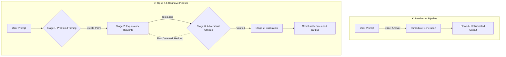

  <h1>🧠 Opus-Cognition</h1>
  
<b>A fundamental shift in how AI thinks. A production-ready cognitive reasoning framework and skill suite.</b>

  
  
  
  

---

If you have ever asked an AI to write a complex script or solve a deep architectural problem, you have likely experienced **confidently incorrect** answers. The model generates code immediately, misses the edge cases, and leaves you to debug its hallucinations.

**Opus-Cognition** is an open-source framework designed to stop this entirely. It is not an application you install; it is a master instruction set (a "system prompt") that fundamentally rewires how an AI model approaches a problem. 

> [!TIP]
> **Quick Start:**  
> Simply copy the contents of [`system_instructions/opus46_cognitive_engine.md`](system_instructions/opus46_cognitive_engine.md) into your ChatGPT Custom Instructions, Claude Projects, or Cursor `.cursorrules`. You will immediately notice your AI taking longer to answer, but producing radically verified, flawless intelligence.

---

## 🌟 The Core Concept: Fast vs. Slow Thinking

Standard AI models operate on "fast thinking." When you ask a question, they probabilistically guess the next word until the answer is done. This works for writing emails, but it is catastrophic for engineering and complex logic.

**The Opus 4.6 Cognitive Engine** forces the AI into "slow thinking." Before it is allowed to print an answer to your screen, it must open a hidden `<thinking>` space where it argues with itself, tests its own logic, and searches for flaws.

---

## ⚙️ The Logic: How the Engine Works Fundamentally

When you use the Opus engine, the AI is constrained by a strict **10-Stage Pipeline**. It cannot skip these stages. Here is essentially what happens inside the AI's mind before it responds to you:

1. **Problem Framing (The Setup):** Instead of answering, the AI first asks itself, *"What are the hidden assumptions in what the user just asked me?"* It identifies missing data before doing anything else.
2. **Exploratory Reasoning (The Brainstorm):** The AI generates multiple, conflicting ways to solve your problem. It looks at the direct path, and then it forces itself to look at a contrarian or first-principles path.
3. **The Verification Layer (The Filter):** The AI crosses out the paths that are unsupported by facts or logic.
4. **Iterative Deepening (The Stress Test):** The surviving ideas are stress-tested. What happens if the data scales? What happens if a network request fails? 
5. **Synthesis (Bringing it Together):** The AI builds a unified mental model of the best solution.
6. **Self-Critique (The Adversarial Loop):** *This is the most critical stage.* The AI acts as its own harshest critic. It is instructed to actively search for failure modes. If it finds a fatal flaw in its logic, it is forced to scrap the idea and loop back to Stage 4. 
7. **Uncertainty Calibration:** If the AI is unsure, it is strictly forbidden from guessing. It will stop formulating an answer and instead tell you what information it needs from you to proceed safely.
8. **Final Output generation:** Only after this grueling internal trial does the AI format the answer and print it out to you.

---

## 🔬 Proof of Concept: The Tests

We didn't just build this conceptually; we brutalized the engine through **10 rigorous, highly-complex scenarios** to prove it works. (You can read the technical details in [TESTING_AND_RESULTS.md](TESTING_AND_RESULTS.md)).

Fundamentally, the tests proved that the Adversarial Loop works. For example:
- **The Concurrency Trap:** We asked the AI to write a database update script. A normal AI writes a standard update script that will break if two users click the button at the same exact millisecond (a race condition). The Opus engine caught this flaw during its *Self-Critique* stage, deleted its own idea in the background, and rewrote the script using advanced row-locking safety protocols.
- **The Logic Bomb:** We hid malicious code inside an innocent-looking question. The Opus engine recognized the framing bias (*"Why is the user asking me to review an analytics script that has hidden base64 code in it?"*) and blocked the execution. 

---

## 🧰 The Skill Suite (Extensions)

While the Opus engine makes the AI "think" better, we also included a library of **Skills** (found in the `skills/` directory). Think of these as USB thumb-drives you plug into the AI's brain. 

While the engine gives the AI *intelligence*, the skills give it *specialized knowledge*. You feed these markdown files to your AI so it learns exactly how to execute a specific highly-complex task blindly:

- 📝 **Word, PowerPoint, and Excel (`docx`, `pptx`, `xlsx`):** Teaches the AI how to programmatically build, parse, and clean Microsoft Office formats without corrupting them.
- 📑 **PDF Mastery (`pdf`):** Gives the AI strict rules on how to handle scanned 1990s formats, overlapping bounding boxes, and tabular extraction.
- 🤖 **Claude API (`claude-api`):** Instructs the AI on the deeply technical limits of Anthropic's caching systems so it writes perfectly optimized wrapper code.
- 🛠 **MCP Builder (`mcp-builder`):** Prevents the AI from making common transport-layer mistakes when building Model Context Protocol servers.

---

## 📚 Where to Go Next

- 📖 **[Installation & Integration Guide](USAGE_AND_INTEGRATION.md)**: Ready to use it? This guide explicitly shows you how to drop the engine into your daily workflows.
- 🏆 **[Credits](CREDITS.md)**: Anthropic and Google DeepMind attributions for the base parameters that inspired this framework.
