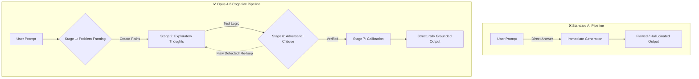

  <h1>🧠 Opus-Cognition</h1>
  
<b>An advanced, production-ready cognitive reasoning framework and skill suite for AI Agents.</b>

  
  
  
  

---

> [!TIP]
> **New Here? Where to start:**  
> Start by opening [`system_instructions/opus46_cognitive_engine.md`](system_instructions/opus46_cognitive_engine.md). This is the core engine. You tell your AI to follow these exact instructions, and it will immediately stop hallucinating and start "thinking" in 10 advanced stages. 
> 
> Once you understand the engine, read the [🚀 Quickstart Usage Guide](USAGE_AND_INTEGRATION.md) to install it into ChatGPT, Copilot, or Cursor.

---

## 📂 Repository Layout (What am I looking at?)

When you look at the files above, here is exactly what they do:

- 📁 **[`system_instructions/`](system_instructions/)** 👉 Contains the core "Opus 4.6" System Prompt. This is the master rulebook that forces the AI into a multi-pass, adversarial reasoning loop before it answers you.
- 📁 **[`skills/`](skills/)** 👉 A library of 8 specialized "Plugins" (like manipulating PDFs or Spreadsheets). You feed these markdown files to your AI so it learns exactly how to execute a specific highly-complex task.

---

## 🌟 The Core Problem We Solve

Standard AI models answer prompts immediately, often leading to deep logical flaws, race conditions in code, or hallucinations.

**The Opus 4.6 Cognitive Engine** intercepts this by forcing the model into a strict **10-Stage Pipeline**. 

Before generating an answer, the AI must open a `<thinking>` tag and:
1. **Explore** multiple opposing reasoning paths. 
2. **Adversarially Critique** its own logic to find hidden flaws.
3. **Calibrate** its confidence and refuse to guess if ambiguous.

## 🧰 The 8 Included Skills

You can hand these instructions to any Agent (like Cursor) to make it an expert in a specific domain:
- `claude-api`: Expert Anthropic SDK & SDK prompt caching limits.
- `doc-coauthoring`: Writing technical specs across multiple git diffs.
- `docx` & `pptx` & `xlsx`: Deep mastery of manipulating Microsoft Office formats blindly.
- `mcp-builder`: Constructing bulletproof Model Context Protocol servers.
- `pdf`: Safely manipulating bounding boxes and OCR inside 90s scanned PDFs.
- `skill-creator`: Instructions for benchmarking and grading other AI prompts.

---

## 📚 Deep Dive Documentation

If you want to see exactly how to install this or see the proof that it works, check out our core docs:

- 📖 **[Installation & Integration Guide](USAGE_AND_INTEGRATION.md)**: Drop this into Claude, ChatGPT, Cursor, and VS Code.
- 🔬 **[10 Real-World Evaluation Tests](TESTING_AND_RESULTS.md)**: See how the engine caught an obfuscated Node.js logic bomb and stopped a backend SQL deadlock.
- 🏆 **[Credits](CREDITS.md)**: Anthropic and Google DeepMind attributions for the base parameters.

 

  
If this saves your codebase from a hallucination, consider leaving a ⭐!

